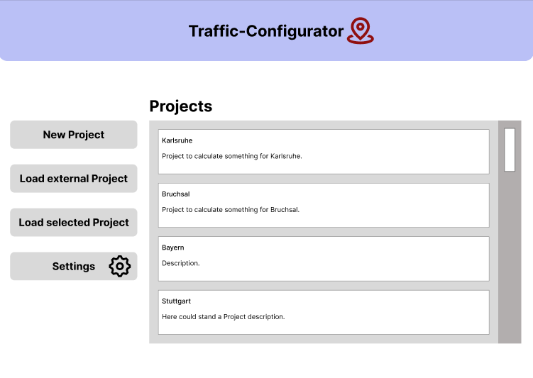
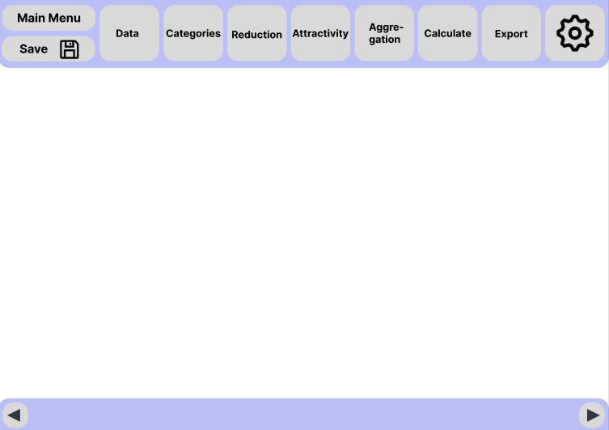

KonfiguratorFuerOSMDaten
========================

Whether it’s biking to college or driving to the supermarket, traffic
effects us all. This product uses generated geodata from the free
project ‘OpenStreetMap’ (OSM) and creates a numerical ranking of the attractiveness of geographic locations. A main focus is the
configurability of the generation of this score. 
Traffic planners can easily use this attractiveness score
for their traffic forecasting models.

|pic1| |pic2|

This project is getting developed in the context of the lecture “Praxis der Softwareentwicklung(PSE)” at the University KIT in 2022,the waterfall model with feedback is used to develop this project.
For each of the phases of the watferfall model you can find the documentation in the corresponding subfolder, in the 
`github <https://github.com/LuposX/KonfiguratorFuerOSMDaten>`_ , most of the documentation is in german.

For a more specific description of the code, check the ``README.md`` in
the subfolder `pythoncode`.

Installation
------------

.. note
   Not implemented yet.

We recommend installing KonfiguratorFuerOSMDaten 
using one of the available built distributions, 
for example using ``pip`` or ``conda``:

.. code-block:: console

    Here will stand sth. in the future

Usage
-----

To use the application after installing it, simply run the program.
For an description about how the application works check out the folder 
``Pflichtenheft``.

License
-------

KonfiguratorFuerOSMDaten is licensed under the GPLv3 `License 
<https://github.com/LuposX/KonfiguratorFuerOSMDaten/blob/main/LICENSE>`__.

Contribution
------------

To contribute to the project:

1. Fork it (https://github.com/LuposX/KonfiguratorFuerOSMDaten/fork)
2. Create your feature branch (``git checkout -b feature/fooBar``)
3. Commit your changes (``git commit -am 'Add some fooBar'``)
4. Push to the branch (``git push origin feature/fooBar``)
5. Create a new Pull Request

